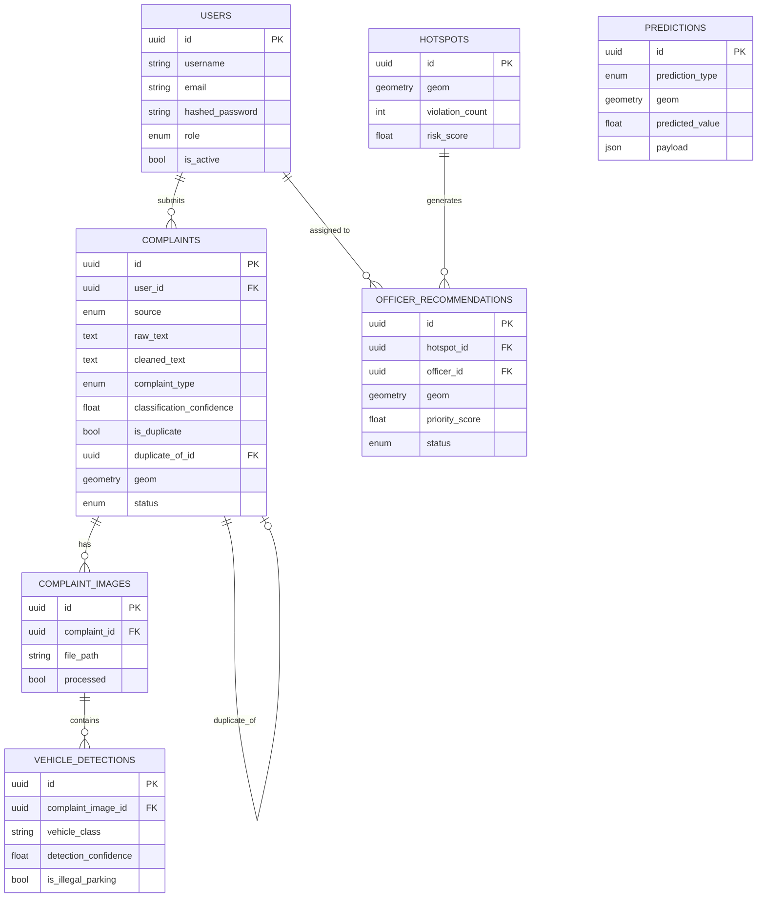

# Database Schema

PostgreSQL 16 + PostGIS 3.4. All primary keys are UUIDs. All geometry
columns use SRID 4326 (WGS84 lat/lng) and have GIST spatial indexes.

## Entity-relationship diagram



## Table notes

### `users`
Citizens, officers, and admins share one table, distinguished by `role`.
Citizens submitting via email/social media don't necessarily have an
account — see `complaints.user_id` (nullable).

### `complaints`
The central table. Fields are grouped by pipeline stage: raw input →
NLP outputs (`cleaned_text`, `extracted_location_entity`,
`complaint_type`, `classification_confidence`, `embedding`) → duplicate
detection (`is_duplicate`, `duplicate_of_id`, `duplicate_similarity_score`)
→ GIS (`geom`, `address`). Fields populated later in the pipeline are
nullable until that stage runs. `source=historical_import` (added in
Module 7) marks rows bulk-loaded from open-data portals via the scripts
in `datasets/`, rather than submitted through the app — these skip the
NLP/CV pipeline (their type/location are typically already known) but
otherwise behave like any other complaint for hotspot clustering and ML
training.

`embedding` (added in migration `0002`) stores the Sentence-BERT vector
for `cleaned_text` as JSON, so duplicate detection only has to embed a
*new* complaint and compare it against already-embedded candidates rather
than re-embedding everything each time. At larger scale this is a natural
candidate for `pgvector` (native vector similarity search in Postgres)
instead of loading candidate embeddings into Python — not needed yet at
expected complaint volumes, but worth revisiting if duplicate-check
latency becomes a problem.

### `complaint_images`
One-to-many with `complaints` (a complaint can include multiple photos).
`processed` flags whether the CV pipeline has run yet, so a background
worker can query for unprocessed images.

### `vehicle_detections`
One row per detected bounding box, one-to-many with `complaint_images`
(an image can show multiple vehicles). Kept separate from
`complaint_images` rather than storing an array, so each detection can be
queried/filtered independently (e.g. "all detections classified as
illegal parking").

### `predictions`
Deliberately generic — one table covers all four ML outputs described in
the spec (hotspot forecast, violation probability, enforcement time,
officer deployment) via `prediction_type` + a `payload` JSON column for
type-specific detail, rather than four near-identical tables. As of
Module 7, only `hotspot_forecast` is actually persisted here (via
`POST /api/predictions/hotspots/forecast`, fully replacing prior rows of
that type each run) — violation-probability is served as an on-demand
estimate rather than precomputed, and enforcement-time/officer-deployment
results land in `officer_recommendations` instead, where they're more
directly actionable.

### `hotspots`
Precomputed spatial clusters for a given time window (e.g. "last 30
days"). As of Module 6, populated by `POST /api/gis/hotspots/recompute`
(PostGIS `ST_ClusterDBSCAN` over geocoded, non-duplicate/non-rejected
complaints), which **fully replaces** this table each run rather than
updating rows in place — treat it as a periodic snapshot, not a durable
history (`period_start`/`period_end` describe the window used for the
*current* snapshot, not an archive of past ones). `risk_score` is a
normalized 0-1 severity metric (cluster size relative to the largest
cluster in the same run) used to rank hotspots on the dashboard.

### `officer_recommendations`
Links a `hotspot` (optional — some recommendations may come directly from
a `prediction` instead) to an optional assigned `officer`, with a
recommended time window and priority score. `status` tracks whether the
recommendation was acted on. As of Module 7, populated by
`POST /api/predictions/recommendations/generate`, which only clears rows
still in `suggested` status before writing fresh ones — an officer's
decision on a recommendation (`accepted`/`dismissed`/`completed`) is
never silently overwritten by a later recomputation.

## Migrations

Schema is managed via Alembic (`backend/migrations/`). The initial
migration (`0001_initial_schema.py`) creates the PostGIS extension, all
enum types, all 7 tables, and spatial indexes. Run with:

```bash
docker compose exec backend alembic upgrade head
```
