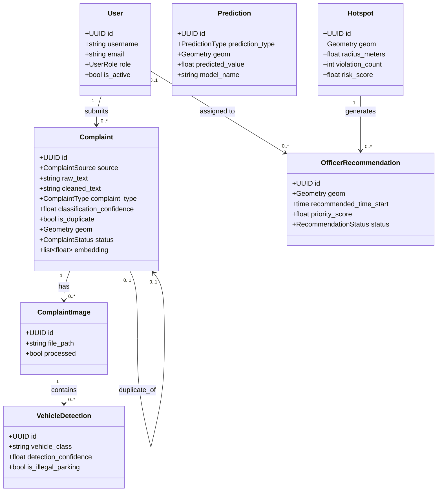

# UML Diagrams

Complements `docs/database_schema.md` (entity-relationship diagram) and
`docs/architecture.md` (system architecture, AI workflow as a flowchart)
with two more traditional UML views: the domain model as classes, and the
complaint-submission flow as a sequence diagram. All in Mermaid, which
GitHub and most modern doc tooling render natively.

## Class diagram — domain model

Mirrors the SQLAlchemy models in `backend/app/models/`, shown as classes
with their key relationships rather than as raw tables (see
`database_schema.md` for the full field-by-field ER view).



## Sequence diagram — complaint submission through the AI pipeline

Shows the actual request/response and background-task flow, including
which steps are synchronous (block the HTTP response) versus
asynchronous (scheduled as a `BackgroundTasks` job and run after the
response is already sent) — the distinction that keeps
`POST /api/complaints` fast despite the pipeline behind it doing
real work.

```mermaid
sequenceDiagram
    actor Citizen
    participant API as FastAPI
    participant DB as Postgres+PostGIS
    participant NLP as NLP pipeline
    participant CV as YOLOv8 (if photo)
    participant GIS as Geocoding

    Citizen->>API: POST /api/complaints
    API->>DB: INSERT complaint (status=pending)
    API-->>Citizen: 201 Created (complaint id)
    Note over API: NLP stage scheduled as a background task —<br/>runs AFTER the response above is sent

    API->>NLP: process_complaint(complaint)
    NLP->>NLP: clean text, extract location entity,<br/>classify type, compute embedding
    NLP->>DB: check recent embeddings for duplicates
    NLP->>GIS: geocode(location_text or extracted entity)
    GIS-->>NLP: lat/lon (best-effort — failure doesn't block)
    NLP->>DB: UPDATE complaint (cleaned_text, type,<br/>is_duplicate, geom, address, ...)

    opt Citizen also uploaded a photo
        Citizen->>API: POST /api/complaints/{id}/images
        API->>DB: INSERT complaint_image
        API-->>Citizen: 201 Created (image id)
        API->>CV: process_image(image) [background task]
        CV->>DB: INSERT vehicle_detection rows,<br/>UPDATE image.processed=true
    end

    Note over DB: Later, on a schedule (see scheduler.py):<br/>hotspot clustering, ML training/forecasting
